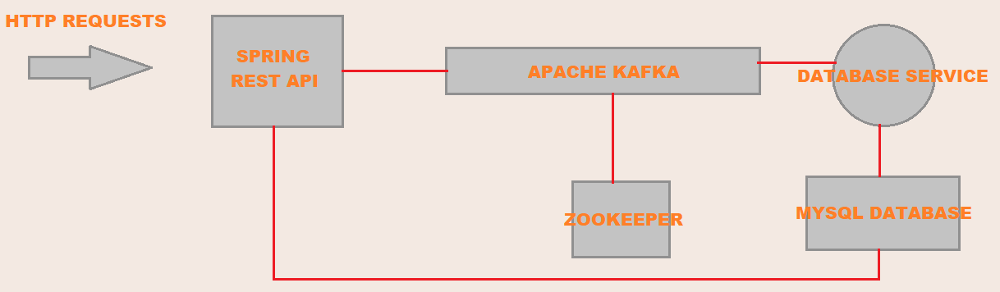

# Task Application
This repository is created for Kartaca internship period task. It is here the used technologies:

| Database  | Rest Api and Database Service | Containerization | Event Streaming | 
|:-:|:-:|:-:|:-:|
|MySQL|Java Spring Boot|Docker|Apache Kafka|

#### Versions

* **MySQL Server:** 8.0
* **JDK:** 8
* **Spring Boot:** 2.4.4
* **Docker Engine:** 20.10.5
* **Docker Compose:** 3.9.0
* **Apache Kafka:** 2.7.0
* **Docker Images:** openjdk:8 - wurstmeister/kafka:2.7.0 - wurstmeister/zookeeper:3.4.6 - mysql:8.0

:grey_exclamation: ---------------------------------------------------------------------------------------------------------------- :grey_exclamation:

**Personal Task Sharing Code:** *gAAAAABgUOwzPuJFbNQpPz8_wPOGRqbfaJoLXJHvwSV1V7pCL0AspLhcYbm6VNs_UnLFjhAPAvm-rPBcNpcQIAEhaKdXackYfhhMvE3MUYWVAqq8EFgZJLOGeUT9DPuTPULbMVfD7QFdhmH2k8_Ps9RBLj07cEQCY0xXYON6GgximjokjiX3ulJD3X-Qc5ez6zcTSYuVtNl0*

:grey_exclamation: ---------------------------------------------------------------------------------------------------------------- :grey_exclamation:

## How It works ?
*There are five components works in individual containers created via docker images shown at the image below.*



User sends an http requests to the web api server with `http://localhost:8080/api/data/${MethodType}` url format and url method type parameter but using http method type has to be same. Supported methods are `Get`, `Post`, `Put` and `Delete`. Then, The Api generates `LogData` model which has `methodType, timeDelay, timestamp` information and creates [mylog.txt](task-rest-api/mylog.txt) file inside its root folder which is written the data inside with `log: "methodType,timeDelay,timestamp"` format. Also it sends this information to the apache kafka as a `json string` for consumer database service to make data processed. Database service gets that data from kafka and saves to the mysql database. At the end, all requests seperated by method types with different colors are shown as a chart for last one hour in a dashboard. The live changes on dashboard is shown at `http://localhost:8080/` root page by using spring websockets.

**URL list**
http://localhost:8080/api/data/${MethodType}
http://localhost:8080/

## How to run ?

**At first you need to download this project, setup appropriate versions of `docker`, `docker compose` and make yourself sure about `8080`, `9092`, `9093`, `3306` ports are not used.**

Open root project folder [task-parent](.) in a terminal and run these commands in order.

```shell
C:\task-parent> docker-compose build
C:\task-parent> docker-compose up -d
```
Or if you use windows, you can just execute [start-project.bat](./start-project.bat) file.

If all containers created successfully, that means system is on! You can send http requests and watch dashboard's change.

# Görev Uygulaması
Bu depo kartaca staj süreci görevi için oluşturulmuştur. İşte kullanılan teknolojiler:

| Veritabanı  | Rest Arayüzü ve Veritabanı Servisi | Konteynerizasyon | Olay Akışları | 
|:-:|:-:|:-:|:-:|
|MySQL|Java Spring Boot|Docker|Apache Kafka|

#### Versiyonlar

* **MySQL Server:** 8.0
* **JDK:** 8
* **Spring Boot:** 2.4.4
* **Docker Engine:** 20.10.5
* **Docker Compose:** 3.9.0
* **Apache Kafka:** 2.7.0
* **Docker Images:** openjdk:8 - wurstmeister/kafka:2.7.0 - wurstmeister/zookeeper:3.4.6 - mysql:8.0

:grey_exclamation: ---------------------------------------------------------------------------------------------------------------- :grey_exclamation:

**Kişisel görev paylaşım kodu:** *gAAAAABgUOwzPuJFbNQpPz8_wPOGRqbfaJoLXJHvwSV1V7pCL0AspLhcYbm6VNs_UnLFjhAPAvm-rPBcNpcQIAEhaKdXackYfhhMvE3MUYWVAqq8EFgZJLOGeUT9DPuTPULbMVfD7QFdhmH2k8_Ps9RBLj07cEQCY0xXYON6GgximjokjiX3ulJD3X-Qc5ez6zcTSYuVtNl0*

:grey_exclamation: ---------------------------------------------------------------------------------------------------------------- :grey_exclamation:

## Nasıl çalışır ?
*Aşağıdaki resimde gösterildiği gibi docker imajları aracılığıyla oluşturulan 5 adet konteyner bileşeni bulunmaktadır.*


Kullanıcı web arayüz sunucusuna `http://localhost:8080/api/data/${metodTipi}` url formatında bir http isteği yollar fakat metod tipi parametresi ile kullanılan http metodu aynı olmalıdır. Desteklenenen metodlar `Get`, `Post`, `Put` ve `Delete`'dir. Sonrasında arayüz içerisinde `methodType, timeDelay, timestamp` verilerini içeren `LogData` modelini üretir ve [mylog.txt](task-rest-api/mylog.txt) dosyasını, içerisinde `log: "methodType,timeDelay,timestamp"` formatında bilgiyi tutacak şekilde kök dizini içerisinde oluşturur. Ayrıyeten, apache kafka'ya `json string` olarak tüketici veritabanı servisinin veriyi işlemesi için gönderir. Veritabanı servisi bu veriyi kafkadan alarak mysql veritabanına kaydeder. En sonunda, pano sayfasında son bir saatlik metod tiplerine göre farklı renklerde ayrıştırılan bütün istekler bir grafikte gösterilir. Panodaki canlı değişimler `http://localhost:8080/` kök dizini sayfasında websoketler kullanılarak gösterilir.

**URL listesi**
http://localhost:8080/api/data/${MethodType}
http://localhost:8080/

## Nasıl Çalıştırılır ?
**Öncelikle projeyi indirmeniz, `docker`, `docker-compose`'un uygun versiyonlarını kurmanız ve `8080`, `9092`, `9093`, `3306` portlarının kullanılmadığından emin olmanız lazım.**

[Task-parent](.) kök dizinini bir terminal üzerinde açın ve şu komutları sırasıyla çalıştırın.

```shell
C:\task-parent> docker-compose build
C:\task-parent> docker-compose up -d
```

Ya da eğer windows kulanıyorsanız, sadece kök dizindeki [start-project.bat](./start-project.bat) dosyasını çalıştırabilirsiniz.

Eğer tüm konteynerlar başarıyla oluşturulduysa, bu demektir ki sistem çalışıyor! Http istekleri gönderebilir ve panonun değişimini izleyebilirsiniz.

